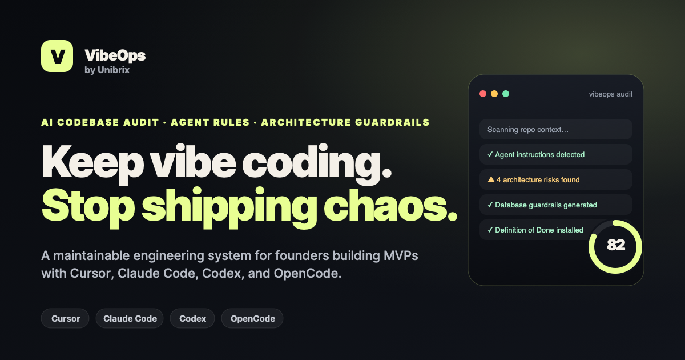

# VibeOps by Unibrix

Vibe code your MVP without creating a technical debt bomb. VibeOps is an engineering setup sprint for founders building MVPs with AI coding agents — Cursor, Claude Code, Codex, and OpenCode. We install architecture guardrails, agent rules, and a review workflow into your repo so the AI keeps shipping fast and the codebase stays maintainable.

  

## What is VibeOps?

VibeOps is a Unibrix productized service that turns AI-coded MVPs into maintainable, scalable products. Founders keep shipping at "vibe coding" speed while the codebase stays reviewable, handoff-ready, and free of architectural debt. It is **not** a generic prompt pack — every Setup Sprint is customized to a real repo, stack, database, and shipping workflow.

**Built for** early-stage founders, technical founders, and founder-CTOs who use Cursor, Claude Code, Codex, or OpenCode — and want to stop being scared of their own code.

## What we install

- **AI Codebase Audit** — review of repo, agent setup, architecture, database, testing, deployment, and risks
- **Agent Operating System** — customized `AGENTS.md`, `CLAUDE.md`, `.cursor/rules`, `docs/architecture.md`, `docs/database.md`, `docs/development-workflow.md`, `docs/definition-of-done.md`
- **Architecture Guardrails** — concrete rules for structure, database, auth, error handling, logging, env vars, testing, security, and deployment
- **Review & Shipping Workflow** — how to prompt the agent, review output, run checks, and ship without random rewrites
- **Founder-friendly Handoff** — docs and structure that let a human engineer (or Unibrix) continue development without starting over

## Supported AI coding tools

Cursor · Claude Code · Codex · OpenCode

## Get started

<a href="https://vibeops.unibrix.com/#access">Request early access</a> on the website. Unibrix is starting with a small number of founder codebase audits.

## Links

- **Website:** [vibeops.unibrix.com](https://vibeops.unibrix.com/)
- **Privacy Policy:** [vibeops.unibrix.com/privacy](https://vibeops.unibrix.com/privacy.html)
- **Contact:** [vibeops@unibrix.com](mailto:vibeops@unibrix.com)

---

Made by [Unibrix](https://unibrix.com)
